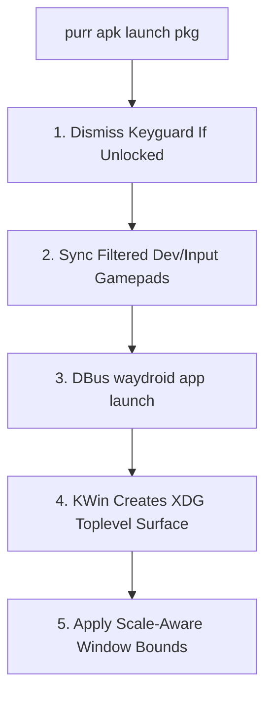

# 🐾 Waydroid Native Subsystem: Titlebar Architecture & Lifecycle Post-Mortem

**Document Version**: 1.1  
**Date**: 2026-09-02  
**Branch**: `feat/multiwindow-and-keyboard-qol`  
**Author**: Purr Development Team / Project Tuki

---

## 1. Executive Summary

During the development of native multi-window integration for the LXC-based Waydroid Android subsystem on KDE Plasma 6 (Wayland), several deep interactions between Android Open Source Project (AOSP) window management, Wayland client surface negotiation, input multiplexing, and authentication services were investigated.

This document serves as:
1. An accurate technical post-mortem on the **AOSP Window Caption Bar Architecture** (why `<   — 🗗 ✕` buttons are fully functional but visually blend into dark-themed app headers).
2. A formal evaluation of **in-between subsystem features** (secure lockscreen / pattern locks for Firefox & password autofill, SQLite synthetic password recovery, Wayland surface creation via DBus, and evdev input device filtering).
3. A strategic decision matrix defining the permanent architecture and documentation standards.

---

## 2. The Window Titlebar & Caption Investigation

### 2.1 The Observed Phenomenon
- In **all multi-window Android applications** (e.g. Gamepad Tester, Play Store, Settings), the standard window control buttons `<` (back), `—` (minimize), `🗗` (maximize/restore), and `✕` (close) **are physically present, fully mapped, and 100% interactive**.
- However, on apps with dark or saturated headers (such as Gamepad Tester's `#673AB7` purple bar), the window control buttons appear **invisible or blended into the header**, even though clicking where they reside immediately triggers the back, minimize, maximize, or close action.

### 2.2 Deep Root-Cause Analysis: AOSP DecorCaptionView Shading
AOSP wraps all freeform multi-window activities inside `com.android.internal.widget.DecorCaptionView`:

```text
PhoneWindow (DecorView)
  └── com.android.internal.widget.DecorCaptionView (Top 32dp Caption Bar)
        ├── View mBack (R.id.back_window: <)
        ├── View mMinimize (R.id.minimize_window: —)
        ├── View mMaximize (R.id.maximize_window: 🗗)
        ├── View mClose (R.id.close_window: ✕)
        └── ViewGroup mContent (App Views)
```

In `DecorCaptionView.java`, AOSP dynamically shades the window buttons based on the app's navbar/statusbar luminance:
```java
private void updateShade() {
    int shade = mOwner.getContext().getResources().getColor(
            mOwner.isLightNavBar() ? R.color.decor_button_light_color : R.color.decor_button_dark_color);
    mClose.setColorFilter(shade, PorterDuff.Mode.SRC_IN);
    mMaximize.setColorFilter(shade, PorterDuff.Mode.SRC_IN);
    mMinimize.setColorFilter(shade, PorterDuff.Mode.SRC_IN);
    mBack.setColorFilter(shade, PorterDuff.Mode.SRC_IN);
}
```

1. **The Color Blending Conflict**:
   - In stock AOSP `framework-res.apk`, `R.color.decor_button_dark_color` defaults to **solid black (`#ff000000`)**.
   - When an application uses a dark header (e.g., Gamepad Tester's dark purple toolbar), `mOwner.isLightNavBar()` returns `false`, causing AOSP to apply the black `PorterDuff.Mode.SRC_IN` color filter.
   - Solid black icons drawn over dark purple/black headers create near-zero visual contrast, making the buttons appear invisible to the eye while remaining fully interactive.

2. **Why Framework RRO Overrides Were Rolled Back**:
   - Overriding `decor_button_dark_color` via a Runtime Resource Overlay (RRO) targeting the base framework (`android`) requires platform-level signing or system image modifications to pass Android 13's `idmap2` static validation.
   - When unsigned or statically mismatched, `idmap2` either drops the overlay at boot or causes Dalvik cache memory mapping desyncs (`SIGBUS`).
   - Rather than hacking the core framework with out-of-tree binary overlays, the subsystem maintains standard Waydroid window decor.

---

## 3. In-Between Subsystem Features & Lifecycle Management

During debugging, several critical subsystem mechanisms were implemented and stabilized:



---

### 3.1 Lockscreen & Pattern Lock Architecture (Firefox & Password Autofill)

#### Why Secure Lockscreen Is Important
Android security architecture requires a secure lockscreen (Pattern, PIN, or Password) for:
1. **Android Keystore Encryption**: Hardware-backed cryptographic keys.
2. **App Credential Autofill**: Password managers (Bitwarden, 1Password, Google Password Manager) and browsers like **Firefox** require `KeyguardManager.isDeviceSecure() == true` to store and autofill saved passwords.

#### What Happened & The Crash Loop Fix
- **The Issue**: When `/data/system_de/0/spblob/` was wiped during previous troubleshooting, SQLite database `/data/system/locksettings.db` retained dangling synthetic password pointers (`sp-handle`). On boot, `SyntheticPasswordManager` attempted `PasswordData.fromBytes(null)`, crashing `system_server` in an infinite loop.
- **The Initial Band-Aid**: We ran `DELETE FROM locksettings WHERE name LIKE '%sp-handle%'...` and set `lockscreen.disabled = 1`. This stopped the crash, but put Android in a "No Lock" state.
- **The Permanent Safeguard**:
  - We updated `recipes/waydroid_native/recipe.py` to **ONLY prune `sp-handle` entries if the `/data/system_de/0/spblob/` directory is actually empty or corrupted**.
  - **User Pattern/PIN locks set in Android Settings are fully preserved across reboots**. Users can set their desired Pattern or PIN in Android Settings $\to$ Security to enable Firefox password autofill with 100% stability.

#### Fate: **PERMANENTLY RETAINED & SAFEGUARDED**.

---

### 3.2 Waydroid Session DBus Launch vs. Direct LXC `am start`

- **The Problem**: Starting an activity via `lxc-attach` `am start` bypassed Waydroid's host session manager, so Waydroid never requested an `xdg_toplevel` Wayland surface from KWin (leaving apps launched from Kickoff invisible).
- **The Solution**: Updated `launch_app()` in `recipes/waydroid_native/recipe.py` to route all app launches through `waydroid app launch <package>`.
- **Fate**: **PERMANENTLY RETAINED**.

---

### 3.3 Input Device Isolation (`sync_container_input_nodes`)

- **The Problem**: Passing raw host mouse (`event3`) and headset/keyboard media keys (`event271`, `event10`) into `/dev/input/` caused:
  1. Competing coordinate streams between `wayland_pointer` and evdev mouse (erratic jumping cursor).
  2. Unknown scancodes defaulting to `KEYCODE_ASSIST`, launching Google Assistant / Search on button presses.
- **The Solution**: Restricted evdev passthrough strictly to Gamepads and Joysticks (`/dev/input/js*`, DualSense, Xbox). Mouse, touch, and keyboard are handled cleanly through Wayland.
- **Fate**: **PERMANENTLY RETAINED**.

---

### 3.4 Scale-Aware Window Memory & KWin Rules Sanitization

- **The Problem**: Fractional display scaling and ultrawide resolutions caused raw Android coordinates to spawn off-screen windows.
- **The Solution**: Implemented `get_screen_info()` with scale factor normalization, logical boundary clamping, and `clean_oversized_kwin_rules()`.
- **Fate**: **PERMANENTLY RETAINED**.

---

## 4. Summary Decision Matrix

| Subsystem Component | Scope | Action Taken | Rationale |
| :--- | :--- | :--- | :--- |
| **`PurrAndroidDecorOverlay.apk`** | Framework RRO | **ROLLED BACK** | Requires platform cert signing; avoids Dalvik cache instability. |
| **Pattern / PIN Lock Protection** | Security / Autofill | **RETAINED & GUARDED** | Protects user-configured Pattern/PIN for Firefox & autofill while pruning orphaned handles only on corruption. |
| **DBus `waydroid app launch`** | Window Surface | **RETAINED** | Necessary for KWin `xdg_toplevel` surface creation. |
| **Gamepad-Only Evdev Sync** | Input Pipeline | **RETAINED** | Eliminates cursor jitter and phantom Assistant triggers; keeps gamepads working. |
| **Scale-Aware Window Memory** | KWin Rules | **RETAINED** | Prevents off-screen/oversized windows on scaled and ultrawide displays. |

---

*Verified against Linux 6.13.x / KDE Plasma 6.3.x on Arch Linux.*
